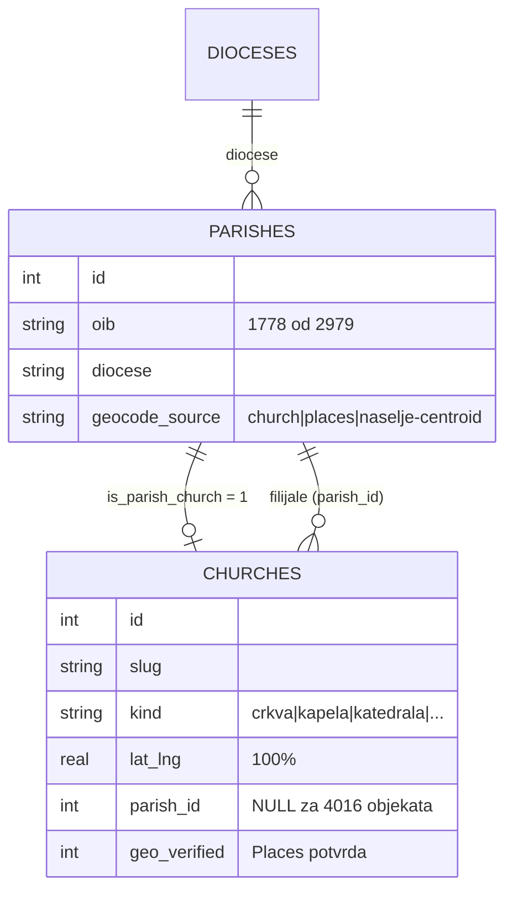
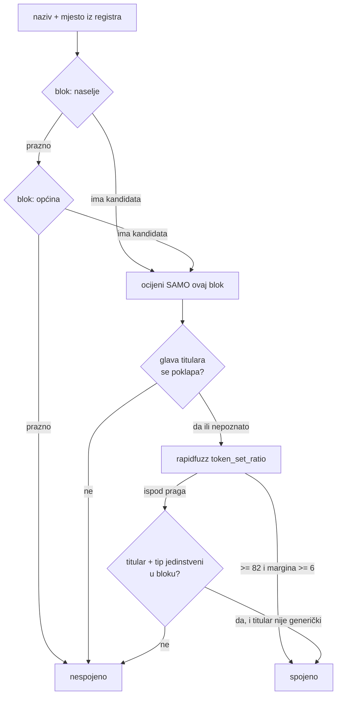

# Izgradnja kataloga — mjerenja, odbačene alternative, zamke

*2026-08-15, prva sesija (od praznog repoa do sloja na gis.domovina.ai)*

Ovaj dokument čuva ono što se **ne vidi iz koda ni iz git povijesti**: brojke
koje su odredile odluke, alternative koje su probane pa odbačene, i zamke koje
su koštale vremena. Kod i trenutno stanje su u [`README.md`](../README.md), a
kratke upute za agente u [`CLAUDE.md`](../CLAUDE.md).

---

## 1. Zašto baš ovi izvori

Prije pisanja ijedne skripte provjereni su kandidati, uživo:

| Izvor | Rezultat provjere | Odluka |
|---|---|---|
| OSM Overpass | 5 349 `place_of_worship`, 6 837 uz širu uniju; 5 256 su tlocrti | **primarni izvor građevina** |
| data.gov.hr — pravne osobe Katoličke Crkve | 2 117 zapisa, 1 563 ŽUPA, s OIB-om i sjedištem | **primarni izvor župa** |
| data.gov.hr — vjerske zajednice | 54 zajednice + 863 org. oblika | nekatolički pandan župama |
| data.gov.hr — Registar kulturnih dobara | 7 950 zapisa, 2 038 sakralnih, **bez koordinata** | zaštita + povijest, spaja se heuristikom |
| Wikidata SPARQL | 844 objekta s koordinatama | slike, Wikipedija, arhitekt |
| Crkveni šematizmi (HBK, biskupije) | per-biskupija, PDF, neujednačeni | **odbačeno** — nije strojno čitljivo |

Ključni nalaz: **državna evidencija je jedini strojno čitljiv potpuni popis
župa u RH.** Šematizmi su potpuniji po sadržaju (filijale, broj vjernika), ali
ih nema u obliku koji se može automatski obraditi.

## 2. Model: dvije tablice, ne jedna

Odbačena alternativa: jedna tablica u kojoj je župa atribut crkve.

Razlog odbacivanja je mjerljiv: **1 563 župa naspram 6 966 građevina.** Jedna
župa ima župnu crkvu + filijale + kapele; 4 016 građevina nema župu (samostanske,
grobljanske, poklonci, nekatoličke). Model s jednom tablicom izgubio bi 1 778
OIB-ova i ne bi mogao izraziti filijalu.

## 3. Matcher: put od 42 % do 55 %

Registri nemaju koordinate, pa se spajaju po nazivu i mjestu. Svaka promjena
je mjerena na istom skupu (2 038 baštinskih zapisa, 1 563 župe):

| Promjena | Baština | Župne crkve |
|---|---:|---:|
| početno (blok = naselje ∪ općina, tvrdi filtar na puni titular) | 847 | 588 |
| + naselje dodijeljeno prostorno iz DGU granica | 847 | 803 |
| + blok u **dvije razine** (naselje, pa tek onda općina) | 1 079 | 1 134 |
| + usporedba titulara po **glavi**, ne po punom nazivu | 1 081 | 1 150 |
| + `_BDM` alternacija (kratice iz registra) | 1 081 | 1 152 |
| + pravilo jedinstvenosti (titular + tip + jedan kandidat) | **1 115** | **1 151** |
| + `GENERIC_TITULARS` (isključi „Majka Božja") | 1 115 | 1 151 |

Redoslijed provjere u `src/match.py`:

**Zašto se razine bloka ne miješaju:** općina Vrgorac ima 25 crkava u
dvadesetak sela. Ako se naselje i općina spoje u jedan skup kandidata, margina
nikad ne da pobjednika i ispravan pogodak propadne. Naselje Dragljane ima
jednu ili dvije.

**Zašto glava titulara, a ne puni:** isti objekt je „sv. Ante" (OSM),
„sv. Ante Padovanskog" (MinKulture) i „SV. ANTUNA PADOVANSKOG" (evidencija).
Tvrdi filtar na puni titular obara match rate za ~11 postotnih bodova.

**Pravilo jedinstvenosti** je za slučajeve gdje se nazivi potpuno raziđu:
„Kompleks Katedrale Uznesenja Marijina" vs „katedrala Uznesenja Blažene Djevice
Marije i svetih Stjepana i Ladislava" daju token_set_ratio **54** — duboko
ispod praga — a riječ je o zagrebačkoj katedrali. Ako se u bloku poklapaju
titular *i* tip, a takav kandidat je točno jedan, to je jači dokaz od bilo
kojeg tekstualnog praga.

**Ali:** pravilo je u prvoj verziji proizvelo **5 lažnih spojeva**, sve u
marijanskoj klasi, jer je „Majka Božja" catch-all za sve zazive pa „Gospa od
Utjehe" i „Gospa od Batka" dobiju isti ključ. Auditom svih 43 spoja nađeni su i
uklonjeni kroz `GENERIC_TITULARS`; ostalo je 35, ručno provjereni, svi točni.

> **Pouka koja se prenosi:** svaki novi *relaksirajući* korak u matcheru mora
> proći ručni audit **svih** spojeva koje je donio, ne uzorka. Pet grešaka u
> 43 nije se vidjelo ni u jednoj agregatnoj brojci.

## 4. Odbačeno: Nominatim za masovno geokodiranje

Prvo rješenje za sjedišta župa bio je Nominatim (kao u sestrinskim repoima).

Mjereno: javni endpoint daje **~5 s po upitu**, a `build_query_candidates`
generira do 5 kandidata po župi → **preko 10 sati** za ~1 800 župa. Nakon 15
minuta bilo je 180 keširanih odgovora.

Zamjena: **težište naselja iz DGU granica** (`geo_hr.settlement_centroid`).
Offline, bez limita, **1,5 s za sve**, uz točnost razine naselja. Pokrilo je
1 668 od 1 828 župa (98 % onih čije je ime naselja jednoznačno).

Nominatim je ostao iza `--nominatim` flaga za slučaj da netko želi razinu
kućnog broja bez Google ključa.

## 5. Places: prvo je štetio, pa je popravljen

Google Places dodan je naknadno, na pitanje korisnika. Uloga mu **nije**
geokodiranje crkava (OSM je bolji — daje tlocrte) nego preciziranje župa i
nezavisna provjera matchera.

Prvi run je izgledao odlično i **tiho pokvario podatke**:

| | 1. run | nakon popravka |
|---|---:|---:|
| Preciziranih župa | 1 117 | 1 005 |
| … >5 km od vlastitog naselja | **268 (24 %)** | 121 |
| najveći promašaj | **392 km** | 39 km |
| Konflikata | 80 | 40 |
| Potvrđenih matcheva | 1 058 | 1 083 |

Uzrok: Text Search *uvijek* nešto vrati, a filtar po županiji se **tiho
preskakao** jer 1 202 župe u evidenciji nemaju upisanu županiju. „ŽUPA SV.
MARIJE MAGDALENE, BEBRINA" (Slavonija) dobila je crkvu u Brseču (Istra).

Popravak na tri mjesta: `scripts/12` prostorno popunjava `parishes.county`
prije Placesa (čime redoslijed 12 → 13 postaje obavezan), `pick()` dobiva
**sidro** s ograničenjem od 15 km, i dodano je 5 testova.

### Sidro ne smije biti vlastiti match

Prva verzija sidra uzimala je koordinate crkve na koju je župa spojena — jer
su najtočnije. To je **provjeru učinilo kružnom**: rezultat koji proturječi
našem matchu odbacio bi se prije nego postane konflikt, pa „nezavisna provjera"
potvrđuje samu sebe.

Sidro je promijenjeno u težište naselja (DGU, ne zna ništa o matchanju).
Izmjereno oboje:

| Sidro | Potvrđeno | Konflikata |
|---|---:|---:|
| crkva (kružno) | 1 083 | 39 |
| naselje (pošteno) | 1 083 | 40 |

Razlika je zanemariva — crkva je ionako gotovo uvijek unutar 15 km od težišta
svog naselja — **ali samo je druga brojka poštena tvrdnja.** Nalaz je vrijedan
upravo zato što je metodološka greška preživjela vlastito pisanje README-a u
kojem je izričito tvrdila suprotno.

### Što konflikti zapravo jesu

Pregledom svih 40: **uglavnom nisu greške matchera** nego druga zgrada iste
župe — župni ured (Vrana, 837 m), pastoralni centar (Korčula, 1,7 km),
samostan umjesto crkve. Zato `geo_conflicts` ništa ne mijenja automatski.

## 6. Zamke koje su koštale vremena

| Zamka | Simptom | Rješenje |
|---|---|---|
| MapLibre `case` traži boolean | `["case", ["get","is_parish_church"], …]` s 0/1 **obori cijeli sloj bez greške na karti** | `["==", ["get", …], 1]` |
| Wikidata P18 vraća `http://` | slika se nikad ne prikaže na HTTPS karti (mixed content) | upgrade sheme u `commons_url` |
| 723 pravne osobe bez OIB-a | 6 zapisa tiho nestalo (dvije zagrebačke „ŽUPA SV. MARKA EVANĐELISTE") | slug sufiks: OIB, inače `SBT_ID` |
| FTS5 s `content=` | indeks i sadržaj se raziđu jer se indeksira `COALESCE(city, settlement, …)` | vlastita kopija, bez external content |
| Overpass bez `User-Agent` | HTTP 406 | header obavezan |
| `karta-web/public/data/` gitignored | sloj radi lokalno, nema ga na produkciji | `SIBLING_LAYERS` u `sync-data.mjs` + deploy |
| `gcloud --allowed-ips` | zamjenjuje **cijelu** listu | uvijek navedi i postojeće IP-ove |

## 7. Otvoreno

- **Repo nema git remote** — sve je lokalno na `main`.
- **923 zaštićena objekta** iz Registra kulturnih dobara bez para u OSM-u
  (`data/exports/bastina-nespojeno.csv`). Dio su ruševine kojih u OSM-u nema.
- **412 župa** (od 1 563) nije spojeno sa svojom crkvom.
- **40 geo konflikata** čeka ručni pregled (`data/exports/geo-konflikti.csv`).
- **121 župa** precizirana Placesom je >5 km od svog naselja — višeznačna imena
  naselja (dvije Privlake, dvoje Selca) gdje sidro nije određeno.
- **`zupe.geojson` se deploya, ali ga nijedan sloj ne čita** — stoji kao javni
  podatkovni endpoint. Sloj za župe bio bi sljedeći korak.
- **Email župa** — nije ni u evidenciji ni u Placesu; išao bi Firecrawlom po
  uzoru na `../klubovi.domovina.ai/scripts/04_backfill.py`.
- **Zaseban frontend** `crkve.domovina.ai` (React PWA) — odgođen, nije odbačen.

## Vezani dokumenti

- [`README.md`](../README.md) — trenutno stanje, izvori, upute
- [`CLAUDE.md`](../CLAUDE.md) — orijentacija za agente, sažete zamke
- [`LICENSE-DATA`](../LICENSE-DATA) — zašto podaci nisu čisti CC-BY (ODbL od OSM-a)
