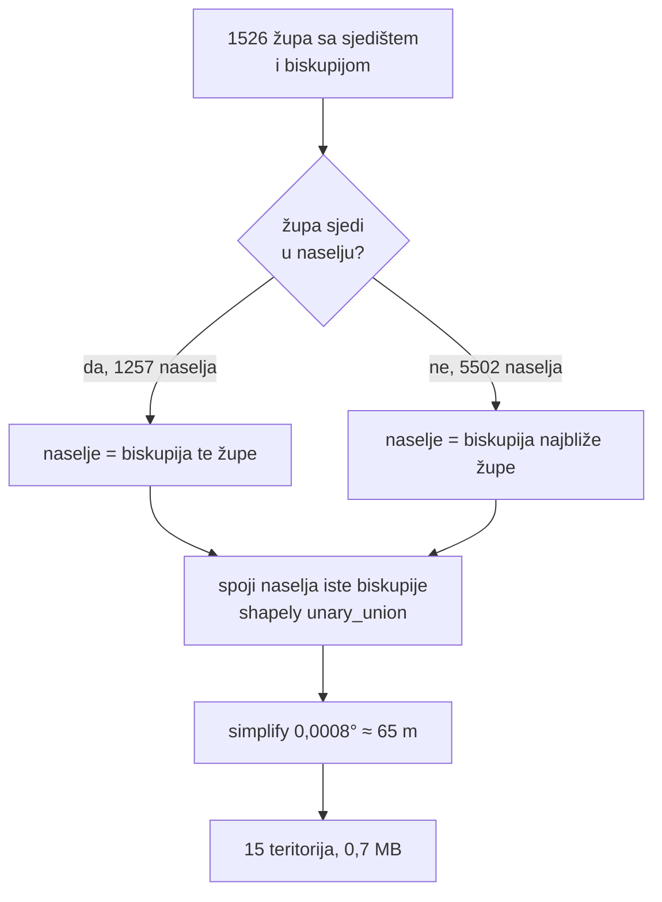

# Teritoriji biskupija — kako se crta granica koje nema

*2026-08-16, druga sesija*

Sloj „✝️ Biskupije" je prvi **derivirani** sloj u ovom katalogu: sve dosad je
bilo preslikavanje izvora, ovo je izračun. Dokument bilježi zašto je izračun
bio jedini put, kako je izmjeren, i što je namjerno ostavljeno vani.

## 1. Prvo je provjereno postoji li uopće izvor

Prije pisanja ijedne linije koda, uživo:

| Izvor | Što ima | Odluka |
|---|---|---|
| OSM `boundary=religious_administration` | **3 od 15** biskupija (Đakovačko-osječka, Požeška, Bjelovarsko-križevačka) + 1 metropolija + Subotička (Srbija) | premalo za sloj — **postaje mjera točnosti** |
| Wikidata `P3896` (geoshape) | **0** za svih 10 hrvatskih dijeceza koje uopće ima; `P402` (OSM veza) također prazan | odbačeno |
| Šematizmi / HBK | popis župa po biskupiji, bez geometrije | već iskorišteno (evidencija) |

Zaključak: granice hrvatskih biskupija **ne postoje kao javno dostupna
geometrija**. Sloj se ili derivira ili ga nema.

Ono što OSM ima nije iskorišteno kao izvor nego kao **test** — hibrid („OSM
gdje postoji, izračun drugdje") bio bi karta na kojoj tri granice znače nešto
drugo nego ostalih dvanaest, a šav između njih sugerirao bi preciznost koje
nema. Ista logika kao kod Places sidra: mjera ne smije biti ono što se mjeri.

## 2. Metoda

**Zašto preko naselja, a ne Voronoi nad župama:** granica onda ide po stvarnim
granicama naselja (DGU), pa izgleda i ponaša se kao administrativna linija.
Voronoi bi dao šiljke koji sijeku sela i obalu.

**Zašto župa u naselju pobjeđuje najbližu:** župa koja *sjedi* u naselju je
dokaz, najbliža je procjena. Bez te prednosti tuđa župa iza granice zna biti
bliža težištu nego vlastita — test `test_zupa_u_naselju_pobjeđuje_bližu_izvana`
fiksira upravo taj slučaj.

## 3. Izmjereno o OSM-u

| Biskupija | Naselja koja se slažu | IoU |
|---|---:|---:|
| Bjelovarsko-križevačka | 591/612 = **96,6 %** | 0,917 |
| Požeška | 718/728 = **98,6 %** | 0,934 |
| Đakovačko-osječka | 367/375 = **97,9 %** | 0,975 |

Kontrolna brojka: zbroj svih 15 teritorija je **56 530 km²**, a kopnena
površina RH je 56 594 km² — razlika 0,1 %.

Mjera „naselja koja se slažu" broji **samo naselja unutar OSM granice**:
nepotpuna OSM relacija inače bi izgledala kao naša greška. To fiksira
`test_agreement_broji_samo_naselja_unutar_osm_granice`.

Brojka nije samo u dokumentu — putuje uz svaki feature (`osm_agreement`) i
piše u popupu na karti, ispod statistike. Karta koja crta izračunatu granicu
mora to reći na mjestu gdje korisnik čita brojke.

## 4. Što NIJE u particiji (i zašto bi tiho pokvarilo kartu)

- **Križevačka eparhija** (grkokatolička) — teritorij joj se *preklapa* sa
  svim latinskim biskupijama, a njezinih 35 župa je razasuto po zemlji. U
  particiji bi svakoj svojoj župi otela komad susjedne biskupije. Izuzeta je
  kroz `dioceses.OVERLAPPING_SLUGS`.
- **Srpska pravoslavna crkva** — državna evidencija svih 403 crkvene općine
  vodi pod jednim imenom („Srpska Pravoslavna Crkva u Hrvatskoj"), bez podatka
  kojoj od 5 eparhija pripadaju. Nema se iz čega derivirati bez novog izvora.
- **Vojni ordinarijat** — neteritorijalan po definiciji.

## 5. Cijena: prva ne-čista ovisnost

Repo je dotad bio httpx + dotenv + rapidfuzz, a `geo_hr` si sam piše
point-in-polygon. Unija 6759 poligona nije nešto što se piše ručno, pa je
**shapely** (+ numpy) ušao u ovisnosti — izoliran na `src/dioceses.py` i
`scripts/20`. Dodjela naselja i dalje ne koristi shapely (vlastiti ray
casting), pa je i dalje testabilna bez njega.

Razmatrana alternativa bez ovisnosti: ne raditi uniju nego na karti obojati
postojeći sloj naselja preko lookupa `naselje → biskupija` (~200 KB). Odbačeno
jer bi sloj biskupija povlačio 21 MB `naselja.geojson` i ne bi imao vlastitu
konturu ni labelu.

## 6. Zamke

- **`queryRenderedFeatures` laže za symbol slojeve** — vraćao je 0 za sloj
  labela koji se uredno crtao (labela „Požeška Biskupija" vidljiva na
  screenshotu). Isto se prije dogodilo s krugom prozirne ispune u sloju župa.
  Pouka: rendering se provjerava okom, ne tim pozivom.
- **Dvije teritorijalne podjele ne mogu obje imati punu ispunu.** Sloj
  biskupija preko JLS ispune daje mulj u kojem se ne čita nijedna. Rješenje:
  kad je sloj biskupija uključen, JLS ispuna pada na prigušeni preset (isti
  koji koristi ortofoto), a mutacija živi u `useJlsLayer` — sloju koji tu
  ispunu i posjeduje.
- **`make all` ne smije se pokretati nakon `make places`** bez ključa: `all`
  ne uključuje korak 13, pa bi `geo_verified` i `geo_conflicts` ostali
  prazni. (Nije uvedeno ovom promjenom, ali je ovdje prvi put primijećeno.)

## Vezani dokumenti

- [`2026-08-16-sloj-zupe.md`](2026-08-16-sloj-zupe.md) — sloj župa i rupa u podacima
- [`2026-08-15-izgradnja-kataloga.md`](2026-08-15-izgradnja-kataloga.md) — kako je katalog nastao
