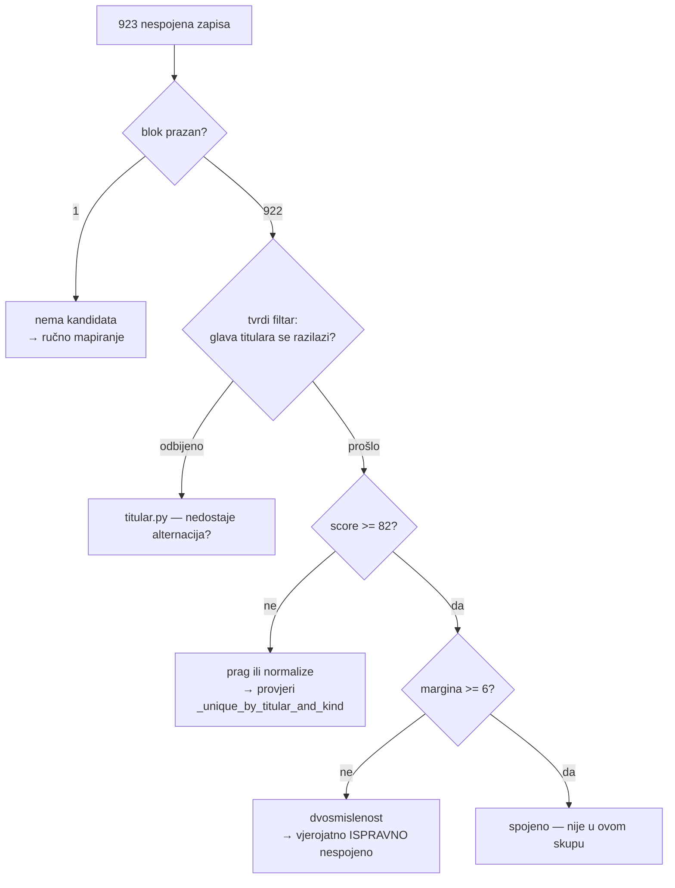

# 923 nespojena baštinska zapisa — jesu li to ruševine ili posao za matcher?

*2026-08-17, treća sesija (samo mjerenje, kod nije mijenjan)*

`docs/2026-08-15-izgradnja-kataloga.md` §7 tvrdi za 923 nespojena zapisa iz
Registra kulturnih dobara: *„Dio su ruševine kojih u OSM-u nema."* Tvrdnja je
bila pretpostavka, nikad izmjerena. Ovaj dokument je mjeri, jer od odgovora
ovisi ima li smisla ulagati u matcher ili je posao ručno mapiranje.

## 1. Nalaz

Za svaki od 923 zapisa iz `data/exports/bastina-nespojeno.csv` provjereno je
ima li `best_match` uopće imao **koga** ocjenjivati — tj. je li blok po naselju
(pa po općini) bio prazan. Usporedba ide na `strip_diacritics` + lowercase,
`bastina.naselje` naspram `churches.settlement`, `bastina.opcina` naspram
`churches.municipality`:

| Situacija | Broj | Što znači |
|---|---:|---|
| naselje zapisa ima građevina u bazi | **821** | blok po naselju je pun — matcher je gledao pa **odbio** |
| naselje prazno, ali općina ima građevina | **101** | pao je i na širu razinu bloka |
| ni naselje ni općina nemaju nijednu građevinu | **1** | jedini slučaj gdje objašnjenje „nema toga u OSM-u" stoji bez rasprave |

Dakle: **za 922 od 923 zapisa skup kandidata NIJE bio prazan.** Neuspjeh je
odluka matchera (tvrdi filtar, prag, margina, odbijena jedinstvenost), a ne
odsutnost podataka.

Bez normalizacije dijakritika ista provjera daje 819/104 — brojka 104 je bila
napuhana pukim razlikama u pisanju (`bastina.naselje` dolazi iz MinKulture,
`churches.settlement` se dodjeljuje prostorno iz DGU granica). Vrijedi kao
podsjetnik: **svaka usporedba imena mjesta u ovom repou mora proći
`strip_diacritics`**, i ad-hoc dijagnostika jednako kao produkcijski kod.

## 2. Što nalaz NE dokazuje

Da je pun blok isto što i prisutan par. Ruševina kapele može stvarno
nedostajati u OSM-u dok isto selo ima župnu crkvu — blok je pun, ispravnog
kandidata nema, i točan ishod je upravo nespojeno.

Nalaz sužava pitanje, ne odgovara na njega: pomiče uzrok s *„blok prazan"*
(mjerljivo neistina za 922/923) na *„matcher je odbio"*, gdje su odbijanja i
dalje mješavina ispravnih i propuštenih.

## 3. Zašto nema jeftinog dobitka na prefiksima naziva

Prva hipoteza bila je da nazive kvare uredski prefiksi Registra
(„Graditeljski sklop katedrale sv. Terezije" za bjelovarsku katedralu), pa bi
ih se skidanjem popravilo mnogo odjednom. Raspodjela prve riječi kaže suprotno:

| Prva riječ naziva | Broj |
|---|---:|
| crkva | 597 |
| kapela | 61 |
| samostan | 23 |
| kompleks / sklop / ostaci / ruševine | 52 |
| ostalo (pil, franjevački, župni, kurija, mauzolej…) | 190 |

Prefiks pogađa ~5 % skupa. **Hipoteza odbačena prije pisanja koda** — 597
zapisa već počinje očekivanom riječju, pa uzrok mora biti u glavi titulara,
`kind`-u ili pragu/margini.

## 4. Sljedeći korak: dijagnoza prije izmjene

Ne dirati prag dok se ne zna raspodjela **faze u kojoj `best_match` odustaje**.
Četiri izlaza su različiti problemi i traže različite popravke:

Tek kad se zna koliko ih pada na X2 naspram X3 naspram X4, zna se i isplati li
se išta mijenjati: X4 su uglavnom **ispravna** odbijanja (dvije slične crkve u
istom selu) i njihovo „popravljanje" proizvodi lažne spojeve.

Vrijedi i dalje pouka iz `2026-08-15` §3: svaki relaksirajući korak prolazi
**ručni audit svih** spojeva koje donese, ne uzorka. Pet grešaka u 43 nije se
vidjelo ni u jednoj agregatnoj brojci.

## 5. Reprodukcija

Mjerenja iz §1 i §3 su ad-hoc, nad `data/crkve.db` i
`data/exports/bastina-nespojeno.csv`, bez izmjena u repou. Ako se ponavljaju
nakon rebuilda: `make derive export sync-karta stats` (**ne** `make all` —
briše `geo_verified` i `geo_conflicts`, vidi `CLAUDE.md`).

## Vezani dokumenti

- [`2026-08-15-izgradnja-kataloga.md`](2026-08-15-izgradnja-kataloga.md) — kako je matcher došao od 42 % do 55 % i koja mjerenja su to odredila
- [`2026-08-16-sloj-zupe.md`](2026-08-16-sloj-zupe.md) — druga polovica iste rupe: 489 župa bez spojene župne crkve
- [`../CLAUDE.md`](../CLAUDE.md) — orijentacija za agente
