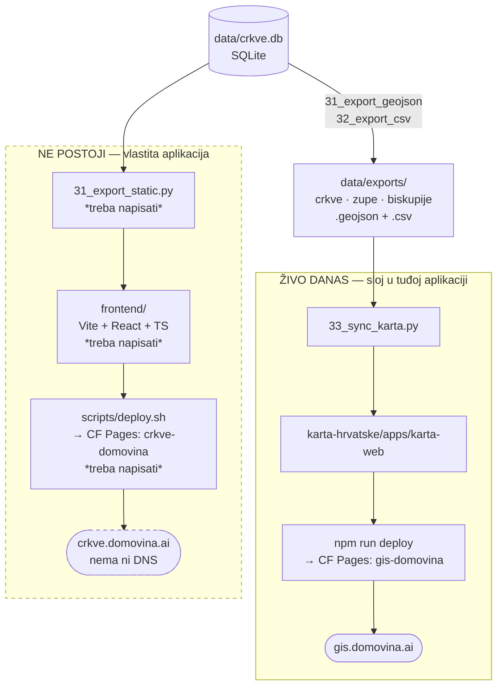

# Zaseban frontend crkve.domovina.ai — što nedostaje

> **ZASTARJELO od 2026-08-28.** Frontend je napravljen i živ je na
> **https://crkve.domovina.ai**. Nije napravljen po ovom planu:
> umjesto Vite SPA + Pages + ručnog `_worker.js` uzet je TanStack Start +
> Nitro → Worker, pa `_worker.js` i obje njegove zamke otpadaju. Što je
> stvarno napravljeno i zašto: **`2026-08-28-frontend-tanstack.md`**.
> Ovaj dokument ostaje jer je stanje koje opisuje („nema ničega") bilo točno
> na dan pisanja, a dijagram dvaju deploy lanaca i dalje vrijedi.

Pitanje iz sesije 2026-08-27 bilo je: *„aplikacija nije još deployana na
Cloudflare, jel tako — ali je priprema za crkve.domovina.ai, možeš li to
odraditi ili treba još developmenta?"*

Odgovor: **u ovom repou nema što deployati.** Nije riječ o nedostajućem
koraku nego o nepostojećem projektu. Ovaj dokument bilježi provjereno stanje i
popis posla, da se ne mora ponovno izvoditi.

## Provjereno stanje (2026-08-27)

| provjera | nalaz |
|---|---|
| `package.json`, `frontend/`, `dist/`, wrangler config u repou | **nema ničega** — samo Python pipeline |
| `dig crkve.domovina.ai` | `NXDOMAIN` — nema DNS zapisa, nema Pages projekta |
| `curl https://gis.domovina.ai/` | `200` — ondje su tri sloja iz ovog repoa |

Jedina isporuka koja je danas live je **sloj unutar tuđe aplikacije**:
`scripts/33_sync_karta.py` prepiše tri GeoJSON-a u
`../karta-hrvatske/apps/karta-web/public/data/`, a ta se aplikacija deploya
zasebno.

## Dva različita deploy lanca

Ovo je glavni izvor zabune: „deploy karte" i „deploy crkve.domovina.ai" nisu
isti posao i ne dijele nijedan korak osim izvora podataka.

**Zamka koju je vrijedilo provjeriti:** `karta-web/scripts/deploy.sh` u prvom
koraku zove `sync-data.mjs`, koji piše u isti `public/data/` u koji je upravo
pisao `33_sync_karta.py`. Izgleda kao da će ga pregaziti — **ne pregazi ga**,
jer `sync-data.mjs` te tri datoteke i sam kopira izravno iz
`../../../crkve.domovina.ai/data/exports`. Deploy karte dakle uvijek povuče
svježe podatke; dovoljno je prije njega pokrenuti `make export`.

## Popis posla za vlastiti frontend

Uzor je `../klubovi.domovina.ai/frontend` — isti stack, ista struktura, isti
Cloudflare račun. Sve navedeno postoji ondje i može se preslikati.

| dio | što je | uzor u klubovima |
|---|---|---|
| Vite + React 18 + TS + Tailwind | rute Home / Karta / Biskupija / Župa / Crkva / Statistika / O projektu | `frontend/src/routes/*` |
| statički export | SQLite → `public/data/*.json` + per-slug datoteke | `scripts/40_export_static.py` |
| sitemap + robots | ~6 966 crkava + 1 561 župa — velik sitemap | `scripts/41_export_sitemap.py` |
| `_worker.js` (Pages Advanced Mode) | SPA fallback + OG meta po slugu + Cache-Control | `frontend/public/_worker.js` |
| `deploy.sh` | export → sitemap → `npm run build` → `wrangler pages deploy` | `frontend/scripts/deploy.sh` |
| CF Pages projekt + domena | domena se kači **ručno** u dashboardu | — |

Cloudflare račun je isti kao za sve DOMOVINA projekte: **D.O.M.,
`CLOUDFLARE_ACCOUNT_ID=7dc7167b7e2e00923bfa7cd697df14e4`**, `wrangler login`
pod tim računom. Projekti su imenovani bez točaka (`klubovi-domovina`,
`gis-domovina`) — po tome bi ovaj bio `crkve-domovina`.

Dvije stvari iz `_worker.js` uzorka koje se ne vide iz koda:

- **`_headers` ne radi dok worker obrađuje request** (CF Pages Advanced Mode
  ugovor) — Cache-Control se mora patchati u workeru.
- **Bez `_redirects` datoteke.** Ako SPA fallback ode kroz nju, `ASSETS.fetch`
  vrati `index.html` za nepostojeći `/klub/*` prije nego worker stigne
  ubaciti OG tagove.

## Otvoreno pitanje: što je jedinica stranice

Klubovi imaju jednu tablicu i jedan slug po stranici. Ovdje su **dvije
tablice koje nisu isti skup** (6 966 građevina naspram 1 561 pravne osobe,
veza N:1) — pa treba odlučiti nose li detaljne stranice građevinu, pravnu
osobu, ili oboje s međusobnim poveznicama. To je odluka o proizvodu, ne o
kodu, i nije donesena.

## Vezani dokumenti

- `docs/2026-08-16-biskupije.md` — kako nastaje sloj biskupija i kako se mjeri
- `docs/2026-08-16-sloj-zupe.md` — sloj župa i brojka „župa bez crkve"
- `docs/2026-08-17-revizija-lokacija-zupa.md` — ispravnost koordinata župa,
  bez koje bi per-župa stranice objavile krive lokacije
