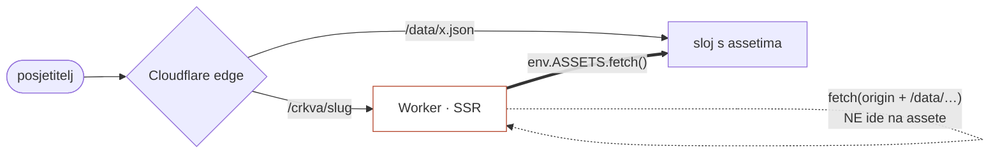
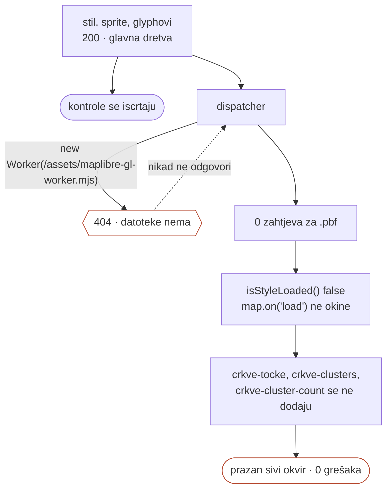

# Vlastiti frontend: od templatea do živog Workera

Nastavak na `2026-08-27-frontend-plan.md`, koji je popisao što nedostaje.
Ovaj dokument bilježi što je napravljeno, koje su odluke donesene i koja je
zamka koštala jednog deploya.

Živo: **https://crkve.domovina.ai** (i dalje i na
`https://crkve-domovina.d-o-m.workers.dev`).

## Odstupanje od plana: drugi stack

Plan je predviđao Vite SPA + Cloudflare **Pages** + ručni `_worker.js` koji
ubacuje OG tagove po slugu, po uzoru na `../klubovi.domovina.ai`. Umjesto toga
je uzet `stepanic/hr-site-starter`: **TanStack Start + Nitro
(`preset: cloudflare-module`) → Cloudflare Worker**, shadcn/ui + Tailwind v4.

Razlog je konkretan: katalog ima ~9400 stranica kojima treba vlastiti
`<title>`, `description`, canonical i OG. SSR to daje iz `head()` po ruti. S
tim otpada cijeli `_worker.js` i obje njegove zamke koje je plan popisao
(`_headers` koji ne radi dok worker obrađuje request; `_redirects` koji pojede
SPA fallback prije nego worker stigne ubaciti OG tagove).

Template je pisan za marketinški web lokalnog biznisa čiji sadržaj piše
čovjek. Maknuto je sve što iz toga slijedi — kontakt forma, Resend,
`LeadDialog`, `LocalBusiness` schema, `/kontakt`, `/privatnost`, `/o-nama`,
`MediaPlaceholder` — a dodan katalog.

## Odluka: dvije jedinice stranice

Otvoreno pitanje iz plana („nosi li detaljna stranica građevinu, pravnu osobu
ili oboje") riješeno je **oboje, s poveznicama u oba smjera**:

| Ruta | Što | Koliko |
|---|---|---|
| `/crkva/$slug` | građevina | 6966 |
| `/zupa/$slug` | katolička župa | 1561 |
| `/ustanova/$slug` | ostale mjesne pravne osobe | 797 |
| `/biskupija/$slug` | (nad)biskupija ili zajednica | 70 |

`/ustanova/` postoji da URL ne laže: samostan i crkvena općina nisu župe.
Podjela nije proizvoljna nego **izmjerena** — spojenih građevina po vrsti
pravne osobe: `zupa` 2780, `samostan` 109, `crkvena-opcina` 37, `svetiste` 2,
a `biskupija`, `eparhija`, `provincija`, `caritas` i „ostalo" (611 zapisa)
**nijednu**. Zato te administrativne osobe nemaju stranicu: bila bi prazna.

## Podaci: statički JSON, bez baze

`scripts/34_export_static.py` (`make export-web`) piše `frontend/public/data/`:
9400 datoteka, 4,7 MB. Worker ih poslužuje kao assete — nema D1, nema
bindinga u konfiguraciji, nema secreta.

Dvije stvari koje su namjerne:

- **Brojke se ne računaju u exportu nego preuzimaju iz `data/exports/stats.json`**,
  a export odbija raditi ako je taj zastario (uspoređuje `crkve_ukupno` s
  bazom). Dva mjesta koja sama računaju „487 župa bez župne crkve" razišla bi
  se; u ovom repou se to već događalo. Otud i redoslijed `stats` → `export-web`
  u Makefileu.
- **Zaostale datoteke se brišu.** Obrisan ili preimenovan slug inače ostavi
  živu stranicu koju nitko ne linka, pa se ne primijeti. Provjereno
  pokretanjem dvaput: druga vožnja daje bajt-identičan izlaz osim
  `manifest.generated_at`, a podmetnuta datoteka nepostojećeg sluga nestane.

Izlaz je gitignoran — 9400 datoteka bi bilo šum u svakom commitu. Regenerira
se pred deploy, isto kao GeoJSON-i u `karta-web`.

## Zamka koja se vidi tek na Workeru

Prvi deploy je prošao, a **svaka stranica s loaderom vraćala je 404**: `/`,
`/crkve`, `/zupe`, `/biskupije`, `/brojke`, sve detaljne stranice i sitemap.
Radile su točno one bez loadera (`/karta`, `/o-projektu`) — i to je bio trag.

Uzrok: SSR loader je dohvaćao podatke s `fetch(origin + "/data/…")`. Na
Cloudflareu takav zahtjev **ne dolazi do sloja s assetima nego se vrati u sam
Worker**, koji za `/data/*` nema rutu, pa loader dobije 404. Lokalno isti kod
radi jer ondje asete poslužuje dev server. Klasa kvara koju lokalni razvoj po
definiciji ne može uhvatiti.

Ispravno je `env.ASSETS.fetch()`. Nitroov cloudflare preset zakači
`{ env, context }` na `request.runtime.cloudflare`, pa se do bindinga dolazi
kroz zahtjev; bez bindinga se pada na obični fetch, što pokriva vite dev.



Pouka je ugrađena u alat, ne samo u dokument: **`scripts/deploy.sh` poslije
deploya sam provjeri sedam ruta i sitemap i padne ako ne prođu.** Prije toga
se ista stvar provjerava lokalno na pravom runtimeu s `wrangler dev --local`,
koji vrti workerd i ima ASSETS binding — za razliku od `bun run dev`.

## Ostale odluke koje se ne vide iz koda

- **Veliki indeks se dohvaća na klijentu, ne u loaderu rute.** TanStack
  serijalizira loader podatke u HTML, pa bi posjetitelj `crkve-index.json`
  (1,5 MB, 282 KB gzip) dobio dvaput. Loaderi nose samo male datoteke.
- **Rupe se ispisuju.** Župa bez spojene građevine dobiva objašnjenje, ne
  praznu sekciju. `church_count` se zadržava i kad je 0 — nula je nalaz.
- **Structured data je `Dataset`, ne `LocalBusiness`**: katalog nema adresu ni
  radno vrijeme. Na građevini `PlaceOfWorship` (ne `CatholicChurch` —
  400-injak zapisa nije katoličko), na pravnoj osobi `Organization`.
- **Sitemap se generira iz indeksa**, 9401 URL. Ručan je samo popis od sedam
  statičnih ruta.
- **Boje karte su u hexu**, jedina iznimka od „sve u oklch": MapLibre ima
  vlastiti parser boja i ne jamči CSS Color 4. Komponenta ih čita
  `getComputedStyle`-om, ne hardkodira.
- **Filtar na karti mijenja podatke izvora, ne `setFilter` na sloju** —
  klasteri se grade iz izvora, pa bi `setFilter` ostavio klastere koji broje
  sakrivene objekte.
- **`maplibre-gl` v6 nema default export.** `(await import(…)).default` je
  `undefined`.
- **Hrvatska sklonidba uz broj** (`sklon`/`broj` u `format.ts`). Prvi deploy je
  pisao „1 spojenih građevina". Pravilo ide po zadnjoj znamenki, s iznimkom
  11–14.

## Što je provjereno, a što nije

Provjereno: `typecheck` čist, `lint` 0 errora (7 react-refresh warninga iz
shadcn komponenti je normalno), `build` prolazi; 11 ruta vraća 200 i na
`wrangler dev --local` i na živom Workeru; nepostojeći slug vraća 404; SSR
`<title>`, `description`, canonical, OG i JSON-LD su u HTML-u prije
hidracije; sitemap 9401 URL.

**Karta je ostala neprovjerena okom, i kad se provjerila — nije radila.**
Vidi sljedeće poglavlje. Instanca je izložena kao `window.__crkveMap` (isti
obrazac kao `window._gisMap` u `karta-hrvatske`), pa se u konzoli vidljivog
prozora provjerava s:

```js
const m = window.__crkveMap;
({ styleLoaded: m.isStyleLoaded(),
   tocke: m.queryRenderedFeatures({ layers: ["crkve-tocke"] }).length,
   klasteri: m.queryRenderedFeatures({ layers: ["crkve-clusters"] }).length })
```

## Druga zamka koju build napravi, a dev ne: MapLibreov worker

Karta na živoj stranici nije radila. Okvir je bio prazno siv, ali **bez ijedne
greške u konzoli** — kontrole (+/−, mjerilo, atribucija) uredno iscrtane, stil
dohvaćen s 200, sprite i glyphovi s 200, indeks od 6966 zapisa učitan, legenda
s 11 vrsta i točnim brojkama ispod karte.

Prva hipoteza je bila već zapisana u dokumentu: skriveni tab, `rAF` ne radi,
MapLibre ne dovrši stil. Izmjerena je i **potvrđena kao pojava, ali odbačena
kao uzrok** — u vidljivom tabu (`visibilityState: "visible"`, `rAF` radi) karta
je stala na istom mjestu. Zapisana tvrdnja iz dokumenta zamalo je pojela drugu
sesiju; nalaz je bio točan, objašnjenje krivo.

Mjerenja koja su pokazala pravi uzrok:

| što | vrijednost |
|---|---|
| `map.isStyleLoaded()` | `false` (neograničeno) |
| `style.tileManagers.openmaptiles.loaded()` | `false` |
| zahtjeva za `.pbf` pločicama | **0** |
| `style.dispatcher.broadcast(…)` | TIMEOUT |
| `GET /assets/maplibre-gl-worker.mjs` | **404** (SPA HTML fallback) |

Nula zahtjeva za pločicama je ključ: pločice dohvaća **worker**, ne glavna
dretva. MapLibre v6 workera ne ugrađuje u bundle nego ga traži kao zaseban
modul, na adresi izvedenoj iz `import.meta.url` vlastitog chunka:

```js
new URL("./maplibre-gl-worker.mjs", import.meta.url)
```

To je URL sastavljen u runtimeu. Bundler ga ne vidi kao import, pa datoteku ne
emitira — u `.output/public/assets/` je bio samo `maplibre-gl-<hash>.js`, bez
workera. Worker se nikad ne javi, dispatcher čeka zauvijek, `map.on("load")` ne
okine i naši slojevi (`crkve-tocke`, `crkve-clusters`, `crkve-cluster-count`)
se ne dodaju. Ništa od toga ne baca grešku.

Lanac je bitan jer objašnjava zašto nema greške: svaki korak samo **čeka**
prethodni, a čekanje nije iznimka.



`bun run dev` to ne može uhvatiti: ondje Vite servira
`node_modules/maplibre-gl/dist/`, gdje worker stvarno stoji uz svoj chunk.
**Kvar postoji samo u buildu** — kao i zamka s asetima iz prethodnog poglavlja,
ali iz drugog razloga: ondje je krivo pitan runtime, ovdje datoteke nema.

Ispravak je `frontend/src/lib/maplibre.ts` — jedina dopuštena točka učitavanja
MapLibrea, koja workera zapakira kroz Vite i prijavi ga prije prve karte:

```ts
import workerUrl from "maplibre-gl/dist/maplibre-gl-worker.mjs?worker&url";
const maplibregl = await import("maplibre-gl");
maplibregl.setWorkerUrl(workerUrl);
```

`?worker&url` tjera Vite da workera zapakira zajedno s njegovim
`maplibre-gl-shared.mjs` (477 kB, bez ijednog vanjskog importa) i emitira kao
hashiran asset. Poslije ispravka, mjereno na `wrangler dev --local`:
`styleLoaded true`, 26 dohvaćenih pločica, 3 naša sloja, 10 klastera na razini
države (zbroj ≈ 6030 = 6966 minus 900 poklonaca ugašenih po defaultu) i 57
pojedinačnih točaka na zumu 13,5 nad Zagrebom. MiniMap na detaljnoj stranici
radi iz istog ispravka.

Pouka za `frontend/CLAUDE.md`: prazan sivi okvir ima **dva** uzroka i
razlikuju se mjerenjem — prvo `document.visibilityState`, pa tek onda worker.

## Domena

Zakačena je iz `wrangler.jsonc`, ne rukom u dashboardu:

```jsonc
"routes": [{ "pattern": "crkve.domovina.ai", "custom_domain": true }],
"workers_dev": true,
```

Wrangler pri deployu sam napravi DNS zapis i certifikat. Dvije stvari koje su
se pokazale tek u praksi:

- **Čim postoji `routes`, `workers.dev` se gasi po defaultu.** Poddomena je
  jedina adresa na kojoj se deploy može provjeriti dok se certifikat za novu
  domenu izdaje, pa je `"workers_dev": true` eksplicitan.
- **Provjera u `deploy.sh` se tiho preskočila.** URL se izvlačio s
  `grep -oE … | head -1`; kad `routes` ugasi workers.dev, grep nema pogodak,
  vrati 1, a `set -euo pipefail` ugasi skriptu — pa je deploy prošao
  neprovjeren i izgledao uspješno. Otud `|| true` i provjera obiju adresa,
  gdje je produkcijska domena „meka" (certifikat zna kasniti koju minutu).

## Sljedeće

- Fotografije: samo 712 od 6966 građevina ima sliku s Commonsa.
- Kontakti župa — i dalje nema izvora.

## Vezani dokumenti

- `2026-08-27-frontend-plan.md` — stanje prije ovoga i dijagram dvaju deploy
  lanaca (sam plan je zastario, vidi zaglavlje ondje)
- `2026-08-16-sloj-zupe.md` — odakle brojka „župa bez crkve" koju frontend
  ispisuje kao rupu
- `2026-08-16-biskupije.md` — kako nastaje derivirani teritorij i njegova mjera
  slaganja, koju stranica biskupije prikazuje uz granicu
- `2026-08-17-revizija-lokacija-zupa.md` — ispravnost koordinata župa, bez koje
  bi 1561 detaljna stranica objavila krivu lokaciju
